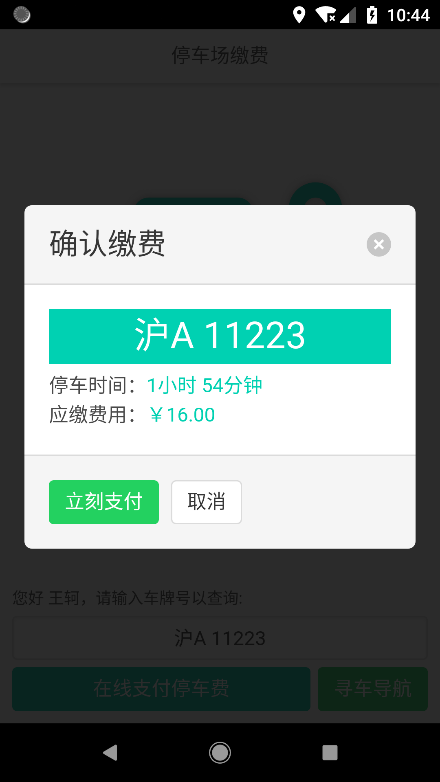
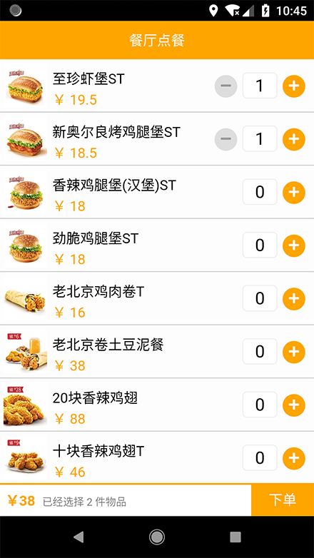
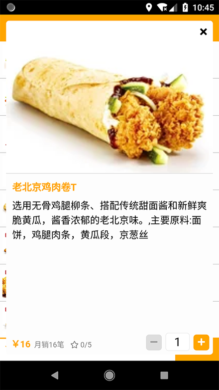
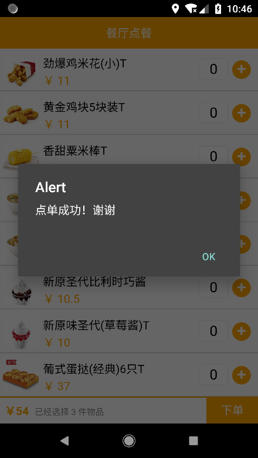

# 应用场景探索

[TOC]

## 停车场缴费 (car-park)

|  |  |  |
| --------------------------- | --------------------------- | --------------------------- |
|  |                             |                             |

这个DEMO同时涉及到读取启动参数（获得停车场ID）、请求用户身份、请求APP内支付等功能，有一个独立的后端，实现了支付时序图的完整流程。

支付框弹出之前，会请求停车场缴费APP的后端生成订单号（数据库会记录订单应付金额、订单内容，并把“已付款”设置为false）。

前端会根据这个后端返回的订单号请求支付，用户同意后进行签名，发回给后端。

后端随即把“已付款”设置为true。

如图，这是停车场缴费程序后端的数据库，有些记录“已付款”为true，有些记录“已付款”为false（虽然向后端请求了支付，但并没有发支付授权签名给后端。是因为用户拒绝了支付请求）。

后端验证完支付授权签名之后，会把支付签名转发给中央服务器。中央服务器随即会验证支付授权签名，在验证通过之后，调用银行转账的接口把费用转给开发者。

如图，这个界面是中央服务器统计的支付记录，各种APP的成功支付都会被中央服务器记录。

## 餐厅点菜 (menu)
|  |  |  |
| ----------------------- | ----------------------- | ----------------------- |
|                         |                         |                         |

这是一个很有商业价值的场景。实现的内容和现在已经存在的扫码点菜比较类似。

用户点击APP即可点菜、下单、在线支付。这个DEMO在用到的技术上和“停车场缴费”类似。

用户同意支付之后，支付授权签名同样会被发给点菜应用的后端（后端可以通知服务员做菜），后端同样会把它转发给中央服务器，以真正实现收款。

如图，这是餐厅点单后端的数据库，可以记录用户已付款的信息和用户的订单内容。

这是中央服务器收到的支付记录，这些记录里的金额是最终可以结算给商户的。 